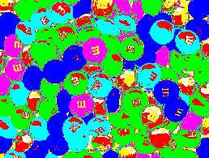
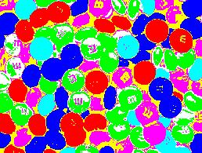
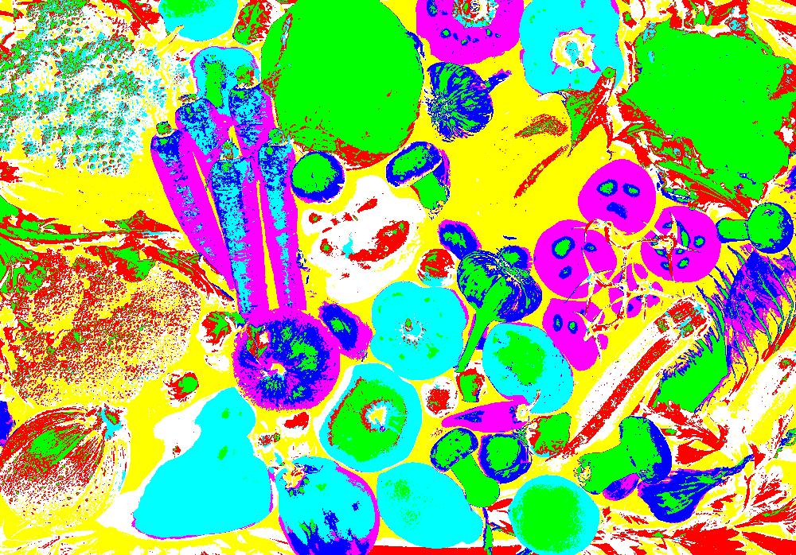
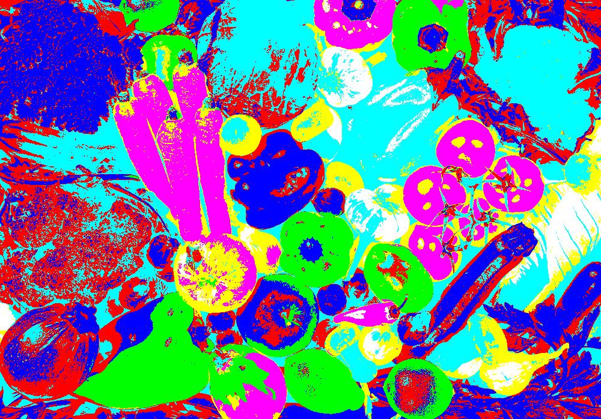

# Image Color Spaces Segmentation in Matlab

## 1. Objective

To implement and compare color-based image segmentation using different color spaces.

## 2. Motivation

Color image segmentation is a very emerging topic for image processing research. Since it has the ability to present the result in a way that is much more close to the
human eyes perceive, so today’s more research is going on this area. Choosing a proper color space is a very important issue for color image segmentation process. Generally the HSV and CIELAB color spaces are the two frequently chosen color spaces for color segmentation, instead of using the RGB color space. 

In this work, we implement color-based image segmentation using RGB, HSV and CIELAB color spaces and present a quanoitative comparison of the segmentation results obtained by using the 3 different color spaces.

## 2. The input Images

We select 2 simple and colorful input images, as illustrated next.

<table>
  <tr>
    <td>
Image-01
</td>
    <td>

Image-02

</td>
   </tr> 
   <tr>
      <td></td>
      <td></td>
  </td>
  </tr>
</table>

## 3. Approach

Color based image segmentation is an active research field. It is typically not performed in the RGB space. Instead it is applied in more suitable color spaces that
separate Luma (brightness/intensity) from Chroma (color). Suitable color spaces include:
* HSV:
   * HS: color information
   * V: Intensity information
* CIELAB:
   * L: Luminance information
   * AB: Color information
   * Euclidian distance between colors is consistent with perceptual difference observed by human beings
* Others color spaces include YCrCb , YUV, HSI, HSL, etc.

In this work, we implement a color based image segmentation using the HSV and CIELAB color spaces. Although this is not adviseable, we also perform the segmentation in the traditional RGB space in order to identify the deficiences of doing this and highlight the benefits of conducting color segmentation in the other color spaces.

The color-based segmentation process can be outlined as follows:
1.Convert the input image to the color space of choice
2.Apply K-means clustering algorithm to segment the K different colors in the new color space
3.Construct a segmentation label map from the K-means clustering results

These steps can easily be implemented in MATLAB as illustrated in the next figures.

  

    
  

  

    
  

Next, we shall illustrate sample results

## 4. Sample Results

The segmentation results for the first input image using the RGB, HSV and CIELAB color spaces are illustrated next.

<table>
  <tr>
    <td> Original Image-001 </td>
    <td> </td>
   </tr> 
   <tr>
    <td> RGB Color Space </td>
    <td> </td>
  </tr>
  <tr>
    <td> HSV Color Space </td>
    <td> </td>
  </tr>
  <tr>
    <td> CIELAB Color Space </td>
    <td> </td>
  </tr>
</table>

The segmentation results for the second input image using the RGB, HSV and CIELAB color spaces are illustrated next.

<table>
  <tr>
    <td> Original Image-002 </td>
    <td> </td>
   </tr> 
   <tr>
    <td> RGB Color Space </td>
    <td> </td>
  </tr>
  <tr>
    <td> HSV Color Space </td>
    <td> </td>
  </tr>
  <tr>
    <td> CIELAB Color Space </td>
    <td> </td>
  </tr>
</table>

The CIELAB color space yields the best qualitattaice image segmentation results as compared to HSV color space and they both both yield more accurate segmentation results than the RGB color space.

## 4. Conclusion

In this project, we implemented color-based image segmentation and demonstrated the benefits of performaing the segmentation in alternative color spaces, instead o fthe traditional RGB color space. The CIELAB color space yields the best qualitattaice image segmentation results as compared to HSV color space and they both both yield more accurate segmentation results than the RGB color space.
